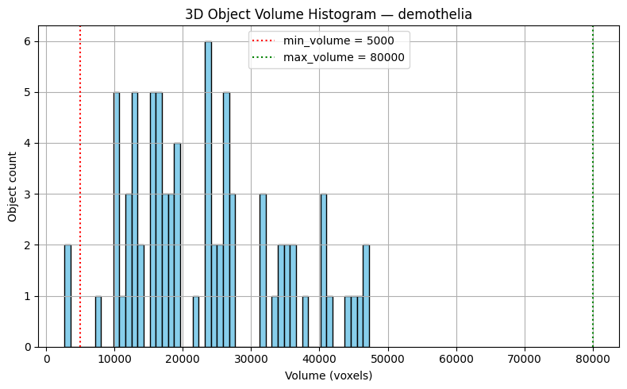
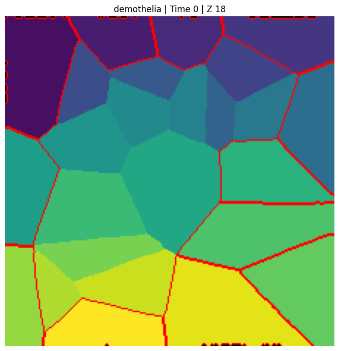
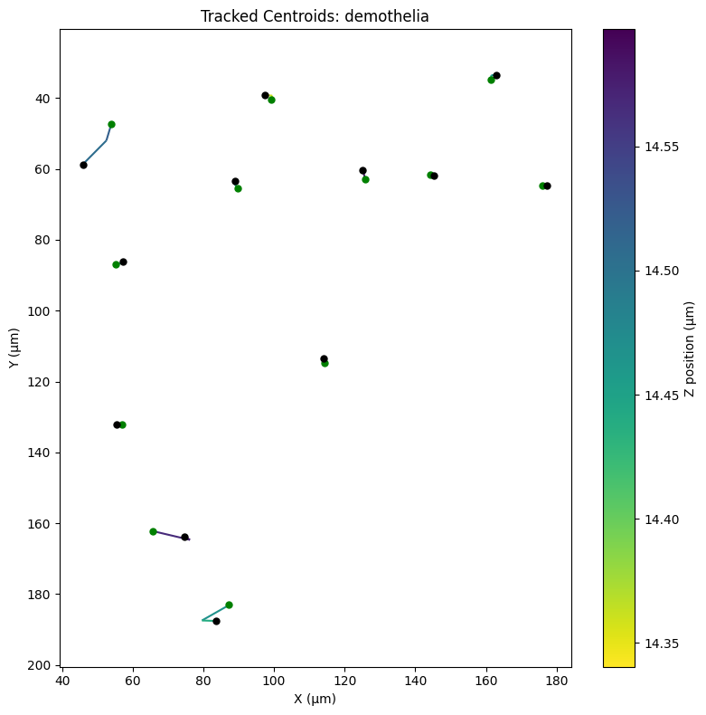
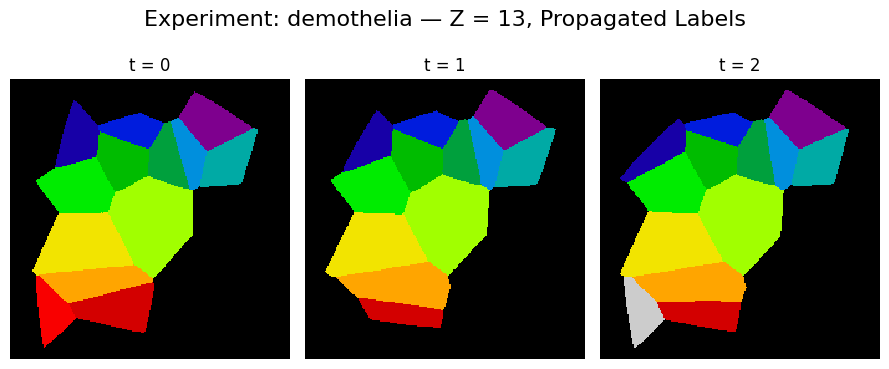
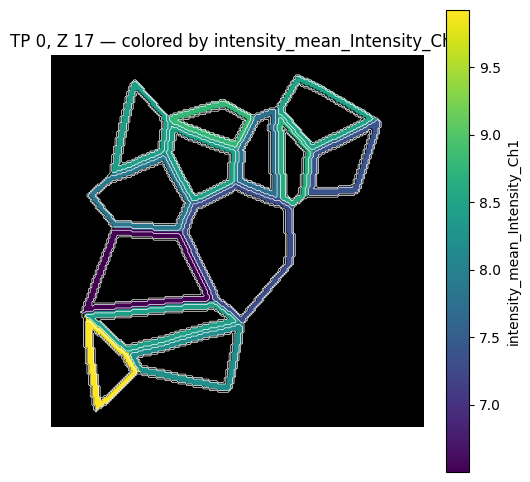
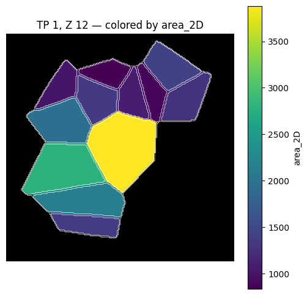

<p align="center">
  
</p>

<p align="center">
  <strong>Segment. Track. Measure.<br/>3D Cell Analysis in Google Colab</strong>
</p>

<p align="center">
<a href="https://colab.research.google.com/github/somaSystems/HyperThelia/blob/main/Hyperthelia_project/notebooks/Run_Demo_hyperthelia.ipynb" target="_blank">
    Run on demo data  
    
  </a>
</p>

---

# HyperThelia

HyperThelia is a modular, Google Colab-based pipeline for **3D timelapse cell image analysis**.  
It runs segmentation, tracking, measurement, and visualisation with **no installation required**.

---

## What It Does

1. Takes **3D timelapse images** (TIFF stacks, one per timepoint)  
2. **Segments** them into cells  
3. **Tracks** cells consistently across time  
4. **Defines regions** and IDs for each object  
5. **Measures** shape and channel intensities  
6. Provides **visualisation and TIFF export**

---

## To Use It

### 1. Connect to Google Colab
Open the demo notebook:

```markdown
[Run the Demo in Colab](https://colab.research.google.com/github/somaSystems/HyperThelia/blob/main/Hyperthelia_project/notebooks/Run_Demo_hyperthelia.ipynb)
```

---

### 2. Upload Your Data

Upload **one TIFF per timepoint**:

```
my_experiment/
 ├─ frame_0001.tif
 ├─ frame_0002.tif
 └─ frame_0003.tif
```

Optionally, add **raw intensity TIFFs** in parallel channel folders:

```
raw_intensity/
 ├─ Channel1/frame_0001.tif ...
 └─ Channel2/frame_0001.tif ...
```

---

### 3. Tell the Notebook Where Your Data Is

In the first Colab cell:

```python
from pathlib import Path

# Project clone location (auto-set in Colab)
CLONE_DIR = Path("/content/HyperThelia")

# Path to your segmentation TIFFs
RAW_DIR = Path("/content/drive/MyDrive/my_experiment")

# Path to optional intensity TIFFs
RAW_INTENSITY_DIR = Path("/content/drive/MyDrive/raw_intensity")
```

---

## Running the Pipeline

### 1. Segmentation
```python
from segmentation import run_segmentation_pipeline, setup_cellpose_model

model = setup_cellpose_model(gpu=True)
run_segmentation_pipeline(
    RAW_DIR, OUTPUTS_DIR, model,
    z_axis=0, channel_axis=None,
    batch_size=32, do_3D=False, stitch_threshold=0.5
)
```

**QC examples:**  
  


---

### 2. Tracking
```python
import tracking, propagation

tracking.run_tracking_pipeline(
    output_base_dir=OUTPUTS_DIR,
    xy_um=0.325, z_um=1.0, max_dist_um=20,
    min_volume=5000, max_volume=80000,
    edge_margin=1, tracking_mode="nearest"
)

propagation.run_propagation_pipeline(output_base_dir=OUTPUTS_DIR)
```

**Tracking results:**  
  


---

### 3. Measurement
```python
import measurement

experiment_data = measurement.discover_experiments(OUTPUTS_DIR, is_tracked=True)
measurement.run_all_measurements(
    experiment_data=experiment_data,
    is_tracked=True,
    compute_surface=True,
    enable_intensity_measurement=True,
    intensity_dir=RAW_INTENSITY_DIR,
    force=False
)
```

**Example measurements:**  
  


---

### 4. Visualisation
Interactive viewer in Colab:

```python
from measurevisualise import interactive_measurement_viewer
interactive_measurement_viewer(OUTPUTS_DIR)
```

Export TIFFs colored by values:

```python
from measurevisualise import export_measurement_values_as_tiff

csv_path = OUTPUTS_DIR / "outputs_my_experiment/measured/regionprops_my_experiment_tracked_3D.csv"
export_measurement_values_as_tiff(
    csv_path=csv_path,
    base_dir=OUTPUTS_DIR,
    timepoint=0,
    value_column="area_voxels"
)
```

---

## Outputs

All results are saved automatically under:

```
outputs/
 └─ outputs_<experiment>/
     ├─ raw_segmented_tiffs/
     ├─ tracking/
     │   ├─ centroids.csv
     │   └─ full_masks/
     └─ measured/
         ├─ regionprops_<exp>_tracked_3D.csv
         └─ regionprops_<exp>_tracked_2D.csv
```

---

## License and Authors

MIT License (see LICENSE file)  

Developed by **Lucas Dent** and **Mallica Pandya**  
Charras Lab
