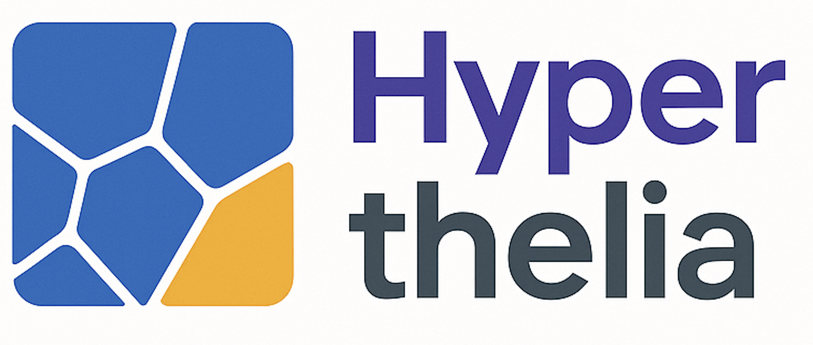

<p align="center">
  
</p>

<p align="center">
  <b>Run HyperThelia on demo data in Colab:</b><br/>
  <a href="https://bit.ly/hyperthelia-demo" target="_blank">
    
  </a><br/><br/>
  One click. No setup. In Colab:<br/>
  1. <code>Runtime → Change runtime type → GPU (T4)</code><br/>
  2. <code>Runtime → Run all</code>
</p>

---

# HyperThelia: 3D Cell Segmentation, Tracking, and Measurement

A modular, Google Colab-based pipeline for segmentation, tracking, and measurement of cells in 3D microscopy images.

---

## What You Need

Just your data.

Place your raw 3D time-lapse TIFFs into a folder.  
If it's a time series, split it into one `.tif` per timepoint:

```
frame_0001.tif  
frame_0002.tif  
...
```

Everything else is handled by the pipeline.

---
## Table of Contents

1. [Run the Demo First](#run-the-demo-first)  
2. [QuickStart (Recommended)](#quickstart-recommended)  
3. [Project Structure](#1-project-structure)  
4. [Initial Setup](#2-initial-setup)  
5. [Segmentation](#3-segmentation)  
6. [Tracking and Propagation](#4-tracking-and-propagation)  
7. [Measurement and Export](#5-measurement-and-export)  
8. [License and Authors](#6-license-and-authors)

---
## Powered By

HyperThelia builds on outstanding open-source tools for scientific image analysis:

- [Cellpose-SAM](https://github.com/MouseLand/cellpose) – for 3D segmentation  
- [TrackPy](https://soft-matter.github.io/trackpy/v0.5.0/) – for centroid-based tracking  
- [scikit-image](https://scikit-image.org/) – `regionprops` and more for shape and intensity measurements

Everything runs in the cloud with GPU acceleration—no local install needed.

---

## Run the Demo First

<p align="center">
  <a href="https://bit.ly/hyperthelia-demo" target="_blank">
     Run_Demo_hyperthelia.ipynb
  </a><br/>
  Just open in Colab and follow the steps inside—no setup required.
</p>

---

## QuickStart (Recommended)

## QuickStart (Recommended)

This is the fastest way to get started using your own data:

1. **Segmentation**  
   [](https://colab.research.google.com/github/somaSystems/HyperThelia/blob/main/Hyperthelia_project/notebooks/hyperthelia_1.ipynb)  
   Run 3D segmentation on your TIFFs using Cellpose-SAM.

2. **Tracking**  
   [](https://colab.research.google.com/github/somaSystems/HyperThelia/blob/main/Hyperthelia_project/notebooks/hyperthelia_2.ipynb)  
   Track segmented objects over time using centroid matching.

3. **Measurement**  
   [](https://colab.research.google.com/github/somaSystems/HyperThelia/blob/main/Hyperthelia_project/notebooks/hyperthelia_3.ipynb)  
   Measure shape, position, and intensity features.

Each notebook runs independently but is designed to run in sequence.  
All results are saved inside the `outputs/` folder.

This is the fastest way to get started using your own data.

1. **Download the entire project directory** from GitHub. It includes all necessary notebooks and folders.
2. **Upload the whole directory to your Google Drive.**
3. Open the first notebook (`hyperthelia_1.ipynb`) in **Google Colab**.
4. In the first cell, **mount your Google Drive**:
   ```python
   from google.colab import drive
   drive.mount('/content/drive')

5. **Define the path to your project directory and raw data folder.**  
   To do this:
   - Use the file browser on the left side of Colab.
   - Navigate to your uploaded folder.
   - **Right-click and choose "Copy Path".**
   - Paste this path into the code cell that defines `BASE_PROJECT_DIR` and `RAW_DATA_DIR`.

   Example:
   ```python
   from pathlib import Path
   BASE_PROJECT_DIR = Path("/content/drive/MyDrive/YourUploadedProjectFolder")
   RAW_DATA_DIR = BASE_PROJECT_DIR / "raw_data"
   ```
6. **Run the first notebook from top to bottom.**
7. When it finishes, run the second notebook: `hyperthelia_2.ipynb`.
8. When that finishes, run the third notebook: `hyperthelia_3.ipynb`.

Each notebook saves its results automatically in the `outputs/` folder inside your project directory.

---

## 1. Project Structure

Your working project directory should follow this layout:

```
YourProjectFolder/
├── raw_data/                          # Raw TIFF folders per experiment
│   ├── YourImages/                   # Just a folder of TIFFs
│   │   ├── frame_0001.tif
│   │   ├── frame_0002.tif
│   │   └── ...
│   └── AnotherExperiment/
├── notebooks/
│   ├── hyperthelia_1.ipynb           # Segmentation
│   ├── hyperthelia_2.ipynb           # Tracking
│   ├── hyperthelia_3.ipynb           # Measurement
│   └── lib/
│       ├── segmentation.py
│       ├── tracking.py
│       ├── propagation.py
│       ├── measurement.py
│       ├── visualisation.py
│       └── measurevisualise.py
├── outputs/
│   └── outputs_<experiment>/
│       ├── raw_segmented_tiffs/
│       ├── raw_segmented_pickles/
│       ├── tracking/
│       │   ├── centroids/
│       │   └── full_masks/
│       └── measured/
└── exports/                           # Optional: TIFFs colored by measurement values

```

---

## 2. Initial Setup

In each notebook, begin by mounting Google Drive:

```python
from google.colab import drive
drive.mount('/content/drive')
```

Define your project directory and raw data folder using absolute paths:

```python
from pathlib import Path
BASE_PROJECT_DIR = Path("/content/drive/MyDrive/YourUploadedProjectFolder")
RAW_DATA_DIR = BASE_PROJECT_DIR / "raw_data"
NOTEBOOK_DIR = BASE_PROJECT_DIR / "notebooks"
OUTPUTS_DIR = BASE_PROJECT_DIR / "outputs"
```

---

## 3. Segmentation

Notebook: `notebooks/hyperthelia_1.ipynb`  
Module: `lib/segmentation.py`

This step performs 3D segmentation using CellposeSAM.

### Key Steps
- Check paths and GPU availability
- Load segmentation model
- Configure segmentation parameters
- Save labeled 3D masks and object data

### Output Folders
```
outputs/outputs_<experiment>/
├── raw_segmented_tiffs/
│   └── segmented_frame_0001.tif
├── raw_segmented_pickles/
│   └── segmented_frame_0001.pkl
```

---

## 4. Tracking and Propagation

Notebook: `notebooks/hyperthelia_2.ipynb`  
Modules: `lib/tracking.py`, `propagation.py`, `visualisation.py`

Tracks objects over time using centroid matching and propagates consistent labels.

### Parameters

```python
XY_UM = 0.325
Z_UM = 1.0
MAX_DIST_UM = 30
MIN_VOLUME = 5000
MAX_VOLUME = 150000
EDGE_MARGIN = 1
TRACKING_MODE = "nearest"
```

### Workflow
- Pre-tracking inspection:
  ```python
  plot_volume_histogram_for_experiment()
  view_segmentation_slice_with_boundaries()
  ```
- Run tracking:
  ```python
  tracking.run_tracking_pipeline()
  ```
- Run label propagation:
  ```python
  propagation.run_propagation_pipeline()
  ```

### Outputs
```
outputs/outputs_<experiment>/tracking/
├── tracked_objects.pkl
├── centroids/centroids.csv
└── full_masks/propagated_t0001.tif
```

---

## 5. Measurement and Export

Notebook: `notebooks/hyperthelia_3.ipynb`  
Modules: `lib/measurement.py`, `measurevisualise.py`

Measures object shape, position, and optional intensity features from masks (tracked or untracked).

### User Toggles
```python
is_tracked = True
compute_surface = True
enable_intensity_measurement = True
intensity_dir = BASE_PROJECT_DIR / "raw_intensity"
force = False
```

### Run Measurement

```python
experiment_data = measurement.discover_experiments(OUTPUTS_DIR, is_tracked=is_tracked)
measurement.summarise_experiment_data(experiment_data)

measurement.run_all_measurements(
    experiment_data=experiment_data,
    is_tracked=is_tracked,
    compute_surface=compute_surface,
    enable_intensity_measurement=enable_intensity_measurement,
    intensity_dir=intensity_dir,
    force=force
)
```

### Output CSVs

Saved to:
```
outputs/outputs_<experiment>/measured/
├── regionprops_<experiment>_tracked.csv
```

Each row = one object per timepoint  
Includes:
- Shape features: `volume`, `centroid`, `aspect_ratio`, `surface_area`
- Intensity: `intensity_mean_<channel>`, `intensity_std_<channel>`
- Validity flags (e.g. `valid_geometry`)

### Optional TIFF Export
```python
measurevisualise.export_measurement_values_as_tiff(
    csv_path=csv_path,
    base_dir=BASE_PROJECT_DIR,
    timepoint=0,
    value_column="surface_area",
    output_dir=BASE_PROJECT_DIR / "exports",
    mode="3d",
    z=18
)
```

### NaN and Background
- `NaN` values remain `NaN` in float32 TIFFs
- Background is 0, so `NaN` is distinguishable for visualization

---

## 6. License and Authors

**License**  
MIT License or project-specific terms (to be specified)

**Authors**  
Developed by **Lucas Dent** and **Mallica Pandya**  
Charras Lab.
